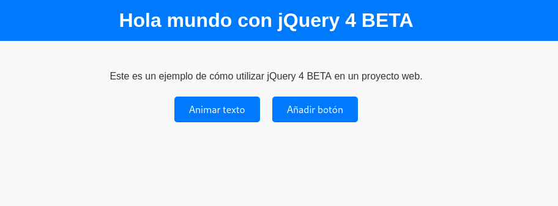

# Proyecto con jQuery 4 BETA

Este proyecto es un ejemplo de cómo utilizar jQuery 4 BETA en un proyecto web.

## Descripción

El proyecto demuestra las siguientes funcionalidades:
- Animar el texto de un párrafo.
- Añadir botones dinámicamente al hacer clic en un botón.

## Estructura del Proyecto

- `index.html`: Contiene la estructura HTML del proyecto.
- `styles.css`: Contiene los estilos CSS para el proyecto.
- `scripts.js`: Contiene el código JavaScript con jQuery para las funcionalidades del proyecto.

## Captura de Pantalla

## Cómo Ejecutar el Proyecto

1. Clona este repositorio en tu máquina local.
2. Abre el archivo `index.html` en tu navegador web.

## Dependencias

- [jQuery 4 BETA](https://jquery.com/)

